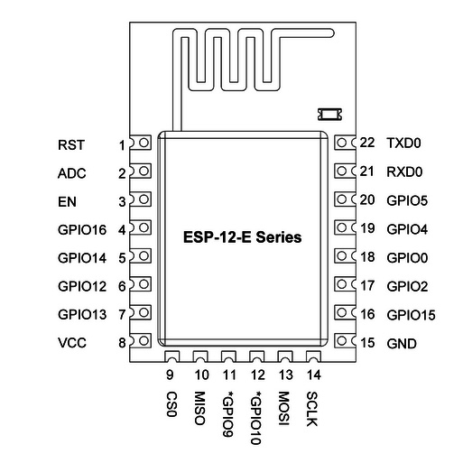

# WOFEA V10 Hack
## Objective
[WOFEA V10 Wifi](https://wofea.fr.aliexpress.com/store/group/V10-Wifi-alarm/902213_513571047.html?spm=a2g0w.12010612.0.0.19cf6442fpjjrc) is a very low cost alarm system based on ESP8266.
Objective of this project is to create a custom and open source firmware based on [esphomelib](https://esphomelib.com/) and [Home Assistant](https://www.home-assistant.io/) ! 

## Hardware
- WOFEA V10 :
    - ESP8266 4M
    - 433Mhz RF transmiter & receiver
    - 2 status Leds
    - Audio ouput & HP
    - Internal Siren 5V output
    - Battery pin : not provided
- PIR & door sensor :
    - 433Mhz transmiter with unique code
    - Detection = send ~10 frame of 24bits
- External siren :
    - 433Mhz receiver only
    - 3 codes : arm, disarm, siren
- Remote control :
    - 433Mhz transmiter
    - 4 codes : arm, disarm, siren, ?

## Internal ESP8266 Pin

- GPIO5 : RF receiver
- GPIO4 : RF transmiter
- GPIO0 : Status led 2 (RED)
- GPIO2 & GPIO15 : Status led 1 (RED/BLUE)
- GPIO3 : Siren ouput
- GPIO16 : Reset button
- Audio output (Mono ?):
  - GPIO14 : Chip output enable ?
  - GPIO12 : Left channel ?
  - GPIO13 :  Right channel ?

## Extract firmware procedure
- Add connector on P1
- Pin from label P1 : GND, TX, RX, VCC (3.3V)
- Connect GND on IO0 (boot loader mode)
- Turn device on (with usb power)
- Run : 
    > esptool read_flash 0x00000 0x400000 firmware.bin
- Dont use crappy usb to serial like [Prolific PL2303HX](https://vilimpoc.org/blog/.../esptool-usb-serial-adapter-shootout/)

## Current esphomelib support
- [x] Status leds 
- [x] Reset button
- [x] Siren ouput
- [x] RF receiver
    - Improve PIR sensor triggers (multiple occurences for one detection)
    - Sometime cause boot loop !
- [ ] RF transmiter
    - Chip is CMT2110A (HopeRf or cmostek)
    - Need rising edge & 800us wait before data transmission
    - Wait ~20ms before new transmission
- [x] Support alarm automation
- [ ] Support audio

## Add backup battery
- Pin charge is ~4.66v
- Find compatible battery...

## Install Home Assitant on OrangePi lite
- Download Debian image : https://www.armbian.com/orange-pi-lite/
- Write on SD card
- Default password is root / 1234

```sh
# Configure Wifi
armbian-config

# Install missing packets
apt-get install jq avahi-daemon dbus apparmor-utils

# Install Docker-CE
curl -sSL https://get.docker.com | sh

# Install Hass.io (H3 is equivalent to RPI2)
curl -sL https://raw.githubusercontent.com/home-assistant/hassio-build/master/install/hassio_install | bash -s -- -m raspberrypi2

# Open url : http://orangepilite:8123
```
Usefull HA plugins :
- esphome
- Samba share
- Duck DNS
- OwnTracks

## Serial ouput sample

```
serial ID is:FF1A0F6801
SDK version:1.5.0-dev(1aafc07)
GetServerURL jdm.smart-ism.com FFFFFFFF
mode : sta(80:f1:eb:80:e1:67)
add if0
200-0-0 0:00:00
Play 7 Sentence, Lanuage=1
scandone
state: 0 -> 2 (b0)
state: 2 -> 3 (0)
state: 3 -> 5 (10)
add 0
aid 3
pm open phy_2,type:2 0 0
cnt 

connected with Livebox-FFFF, channel 1
dhcp client start...
200-0-0 0:00:02
ip:192.168.1.21,mask:255.255.255.0,gw:192.168.1.1
socket_fd = 0
35.156.42.45
Try to connect server
socket_fd = 1
connect OK
recv 0x87 Commamd
recv 0x87 Commamd
```